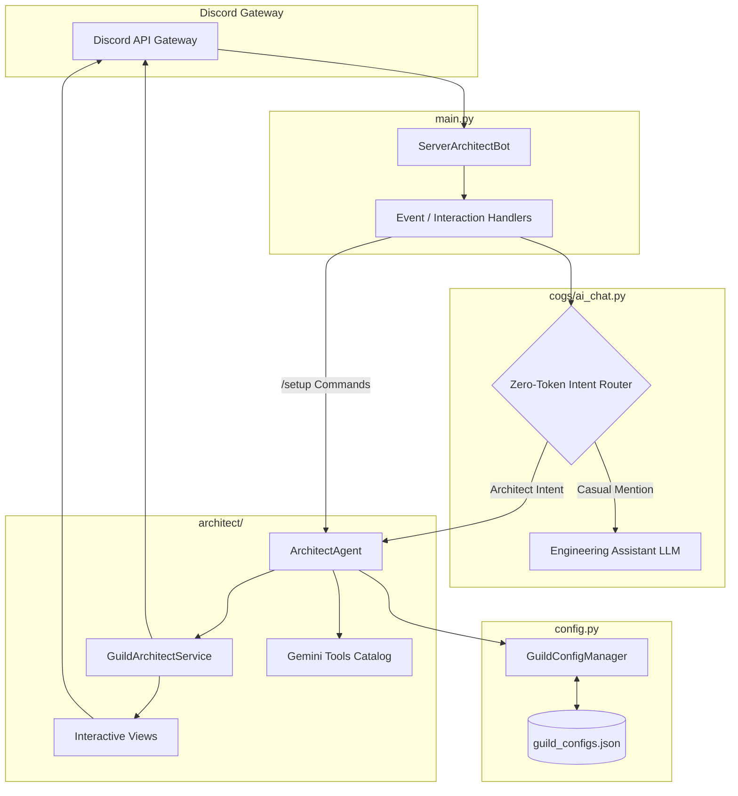

# Architecture & Technical Design · Discord Server Architect

> Comprehensive technical architecture specification for the standalone Discord Server Architect Bot.

---

## 1. System Overview & Component Graph

The bot is designed with a strict decoupled sub-engine architecture to achieve three primary engineering goals:
1. **Zero-Token Idle Cost**: Casual everyday chatter never incurs LLM tool schema overhead.
2. **Deterministic Scaffolding**: Server mutations are executed through validated programmatic service methods rather than unstructured text outputs.
3. **Dynamic Authority**: Zero hardcoded IDs; dynamic resolution of Server Owners, Administrators, Discord Teams, and configurable Architect Roles.



---

## 2. Zero-Token Intent Routing Pipeline

Conventional tool-augmented LLM bots attach tool declarations to every prompt. For an architect bot, sending schemas for channel CRUD, role hierarchies, and declarative blueprints consumes ~1,500 prompt tokens on *every* casual greeting ("hi bot", "how are you?").

### Routing Logic
```python
# Evaluates in O(1) time without API requests or token expenditure
if _ARCHITECT_INTENT_RE.search(cleaned_text):
    await self.architect_agent.handle_architect_prompt(message, cleaned_text)
else:
    # Casual conversation using compact assistant prompt (~180 tokens)
    await self.generate_conversational_reply(message, cleaned_text)
```

### Regular Expression Scope
The regex detects:
- Layout and blueprint requests: `(setup|scaffold|build|reorganize|redesign) (a |an |the |new )*(server|channels?|roles?|...)`
- Channel & role mutations: `(create|make|add|wipe|purge|delete|remove) (a |an |the |new )*(channels?|roles?|...)`
- Native Community Onboarding: `(audit|check|suggest|configure) (our )*(community )*onboarding`
- Direct role manipulation: `assign/remove role`, `guild genesis`

---

## 3. Dynamic Clearance Resolution

Access control is evaluated dynamically per interaction through `GuildConfigManager.is_authorized(member, bot)`. The authorization matrix is evaluated in the following order:

```
[ Incoming Request ]
         │
         ▼
[ Is member.id == BOT_OWNER_ID? ] ──────────────► Granted (Global Owner)
         │ No
         ▼
[ Is bot.application.owner matched? ]
  • Individual: owner.id == member.id
  • Team: member.id in team.members ────────────► Granted (App Owner / Team)
         │ No
         ▼
[ Is member.id == guild.owner_id? ] ────────────► Granted (Guild Owner)
         │ No
         ▼
[ Has Administrator permission? ] ─────────────► Granted (Server Admin)
         │ No
         ▼
[ Has configured Architect Role? ] ────────────► Granted (Delegated Role)
         │ No
         ▼
   Access Denied
```

### Persistence
Per-guild settings are stored in `data/guild_configs.json` using a thread-safe, atomic file write protocol. No external database (MongoDB/Redis) is required.

---

## 4. Autonomous Scaffolding & Blueprint Engine

### Declarative Pipeline Stages
When Gemini invokes `apply_declarative_blueprint`:

1. **Stage 1 · Role Genesis**:
   - Compiles roles top-down.
   - Evaluates hex color codes (e.g. `#00E5FF`, `#9D00FF`).
   - Configures hoist and mentionable flags.
   - Enforces bot hierarchy boundaries (`role < guild.me.top_role`).

2. **Stage 2 · Channel & Category Layout**:
   - Scaffolds parent categories.
   - Creates text and voice channels with parent category bindings.
   - Sets channel topics and locked overrides (`@everyone` send permissions).

3. **Stage 3 · Verification Gate Deployment**:
   - Deploys glassmorphic embed to target channel.
   - Attaches `VerificationButtonView` with encoded role ID `setup_verify:<role_id>`.

4. **Stage 4 · Server Guide & Rules**:
   - Publishes formatted rule cards and guidelines with minimal glyphs (`✦`).

---

## 5. Native Discord Community Onboarding Sub-Engine

The bot interfaces directly with the native Discord Community Onboarding API via `guild.edit_onboarding`:

```
                 [ Community Audit ]
                          │
          ┌───────────────┴───────────────┐
          ▼                               ▼
 [ Feature Check ]              [ Default Channels ]
  • "COMMUNITY" in features?     • Read & view perms for @everyone
  • Onboarding enabled?          • Minimum channel threshold
          │                               │
          └───────────────┬───────────────┘
                          │
                          ▼
            [ Configure & Deploy ]
             • Validate len(options) >= 2
             • Auto-create referenced roles
             • Call guild.edit_onboarding()
```

### API Constraints & Protections
1. **$\ge 2$ Options per Prompt**: Enforced in code before dispatching to the Discord API to prevent `HTTP 400 Bad Request`.
2. **Community Required Channel Shield**: Automatically protects `rules_channel` and `public_updates_channel` during mass purges.
3. **Role Hierarchy Boundary**: Skips or reports roles positioned at or above the bot's highest role.

---

## 6. Resilience & Timeout Defense

| Vulnerability | Mechanism | Defense Implemented |
| :--- | :--- | :--- |
| **Discord 3s Timeout** | LLM generation takes 2–5s | Immediate `await interaction.response.defer()` before cognitive calls. |
| **Reboot Button Loss** | Ephemeral views lost on restart | `custom_id="setup_verify:<role_id>"` handled globally in `main.py`. |
| **API 429 Rate Limits** | Batch creation of 20+ channels | Automatic exponential backoff with retry on `HTTP 429`. |
| **Gemini Quota Exhaust** | Key rate limits / daily caps | Multi-key failover array in `.env` (`GEMINI_API_KEYS`). |
| **Empty Clean Content** | Raw mentions stripped to empty | Guarded with early return `if not cleaned: return`. |
